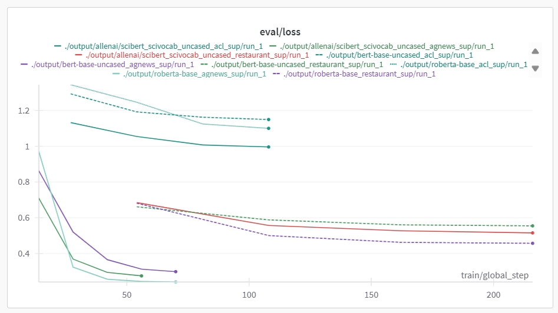
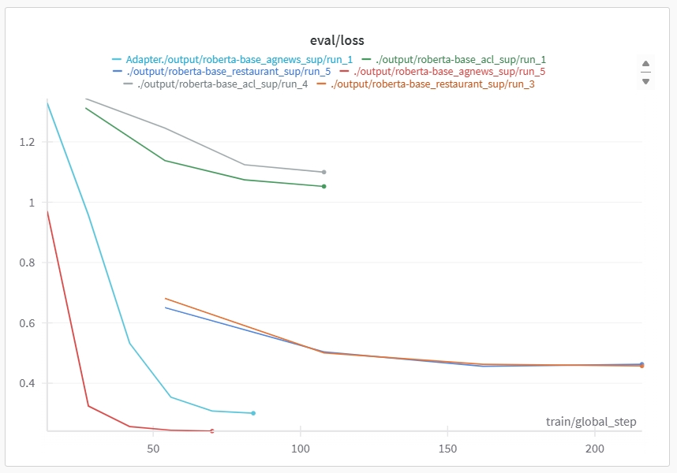

# Assignment 2 Report

学号：2200017853
姓名：李长烨

## Task2

### Experiment Setting

本实验对比了roberta-base, bert-base-uncased, allenai/scibert_scivocab_uncased三个模型在restaurant, acl, agnews三个数据集上的训练表现，restaurant,和acl数据集上的训练在4070-laptop GPU上进行，训练参数为$epochs=4,\ batch\ size=64,\ learning\ rate=1e-5$; agnews数据集由于数据量较大，训练在8x3090 GPU集群上进行，训练参数为$epochs=5,\ batch\ size=64,\ learning\ rate=2e-5$。每个实验重复五次，共9组45次训练，具体的实验数据，包括训练和评估的曲线metric位于result文件夹中。训练的曲线图表主要包括loss，评估的曲线图表主要包括f1_macro, f1_micro, loss和accuracy

### Experiment Result

以下图片展示了9组训练的评估曲线，

可以看出在agnews和restaurant数据集上robert-base模型的loss最低，而在acl数据上allenai/scibert_scivocab_uncased模型的loss最低；对比数据集而言，相同训练参数的情形下，restaurant在三个模型上的训练效果均好于acl。对比最终收敛情况而言，agnews是三个数据集中的最佳数据集，在epoch选择上，本实验已经确保了所有数据集在模型上的loss达到收敛，但由于时间限制，其他参数的优化和挑战还有待探索。

从实验结果来看，三个模型在不同数据集差异的主要原因可能是：

**模型对比上**
roberta-base 模型在 restaurant 和 agnews 数据集上的表现优于其他模型，这可能是因为这两个数据集的语言风格、句法结构与 roberta-base 的预训练数据更相似。
allenai/scibert_scivocab_uncased 在 acl 数据集上表现最佳，这可能是因为 acl 数据集包含更多学术领域的内容，而 scibert 是基于科学文献语料进行预训练的，自然在处理学术文本时具有优势。

**数据集对比上**
agnews 数据集的规模较大，模型在更丰富的训练样本中可以更好地学习到数据分布，因此即使训练参数不同，其最终收敛效果也较好。
相比之下，acl 数据集的样本量和领域专属性较高，模型可能在理解和分类学术文本时遇到更大的挑战，因此需要更针对性的数据来提高模型表现。

## Task3

本实验在robert-base上实现了Adapter，在restaurant, acl, agnews三个数据集上进行了训练。restaurant,和acl数据集上的训练在4070-laptop GPU上进行，训练参数为$epochs=4,\ batch\ size=64,\ learning\ rate=1e-5$; agnews数据集由于数据量较大，训练在8x3090 GPU集群上进行，训练参数为$epochs=6,\ batch\ size=64,\ learning\ rate=5e-5$。每个实验重复五次，共3组15次训练，具体的实验数据，包括训练和评估的曲线metric位于result文件夹中。训练的曲线图表主要包括loss，评估的曲线图表主要包括f1_macro, f1_micro, loss和accuracy

以下展示了Adapter-robert-base和robert-base在三个数据集上的对比，Adapter-robert-base为绿，深蓝，浅蓝三条曲线。

Adapter-robert-base在acl数据集上训练结果优于robert-base，在restaurant数据集上训练结果与robert-base相当，在agnews数据集上训练结果劣于robert-base。

实验结果表明，Adapter-RoBERTa 在特定领域或一致性较高的数据集（如 acl 和 restaurant）上表现优于或相当于 RoBERTa，适合学术或一致性强的数据内容；而在通用、大规模的数据集（如 agnews）上，RoBERTa 表现更优。Adapter 层的引入在特定领域能增强模型的细微特征学习，但大型数据集上训练时，部分参数的冻结可能使得模型无法达到最佳的收敛效果，初步推测模型的peft微调性能下降和数据集复杂度有很强的相关性

### Question 1: If you directly fine-tune a 3B model without PEFT, how much GPU memory do you need?

Model parameters: 3B parameters.
Assuming mixed-precision training (using FP16), each parameter occupies 2 bytes.
Memory for parameters: $3*10^9 parameters*2bytes=6GB$

Gradients are the same size as model parameters.
Memory for gradients: 6 GB.

For the Adam optimizer, two additional tensors are maintained per parameter.
Memory for optimizer states: 12 GB.

Depending on batch size, sequence length, and model architecture, activation memory is often comparable to or larger than the model size.
For estimation, assume activation memory is approximately 6 GB.

$Total Estimated Memory=Parameters+Gradients+Optimizer\ States+Activations=30GB $

So you would need approximately 30 GB of GPU memory to fine-tune a 3B model without PEFT.

### Question 2: With PEFT, how much GPU memory is saved?

Model Parameter:The frozen model parameters are still required during the forward pass, occupying 6 GB of memory.

Trainable Parameters: Assuming that the additional parameters are about 0.5% of the original model, $number of additional parameters=3*10^9*0.005=15M$. Memory for additional parameters=30MB

Accordingly, memory for gradients and optimizer states=90MB

Activations:The memory required for activations remains similar to direct fine-tuning, around 6 GB.

$Total Estimated Memory=Parameters+Additional\  Parameters+Gradients+Optimizer\  States+Activations=12.12 GB$

The results in a memory saving of approximately 17.88 GB, or around 60%.